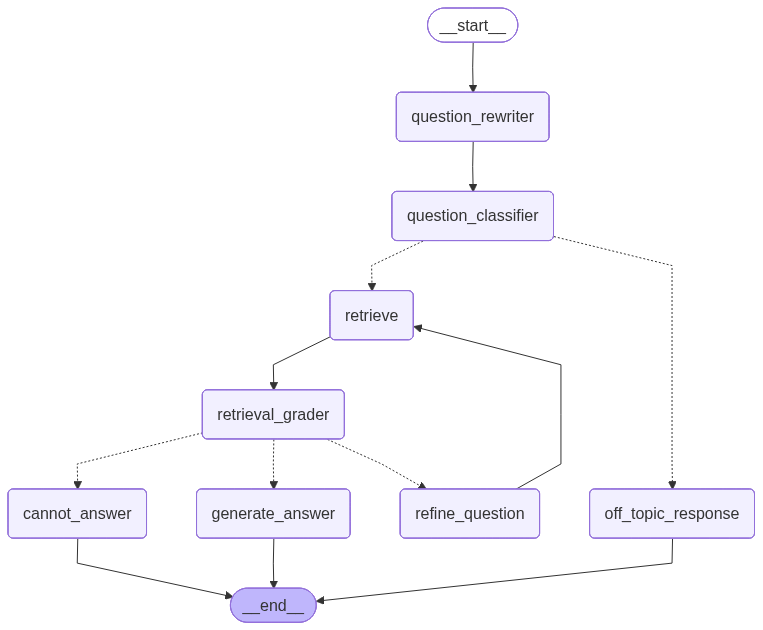
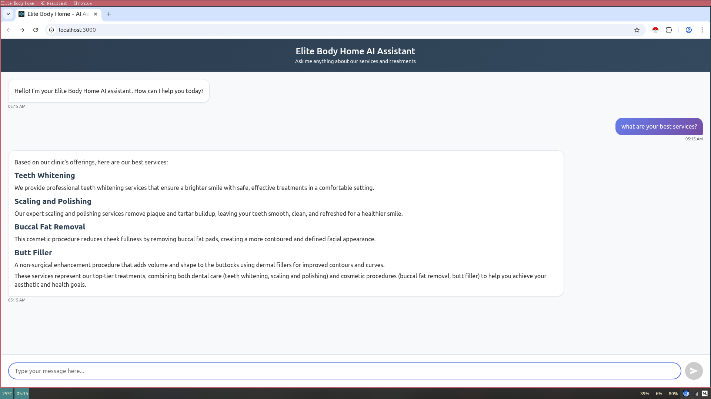
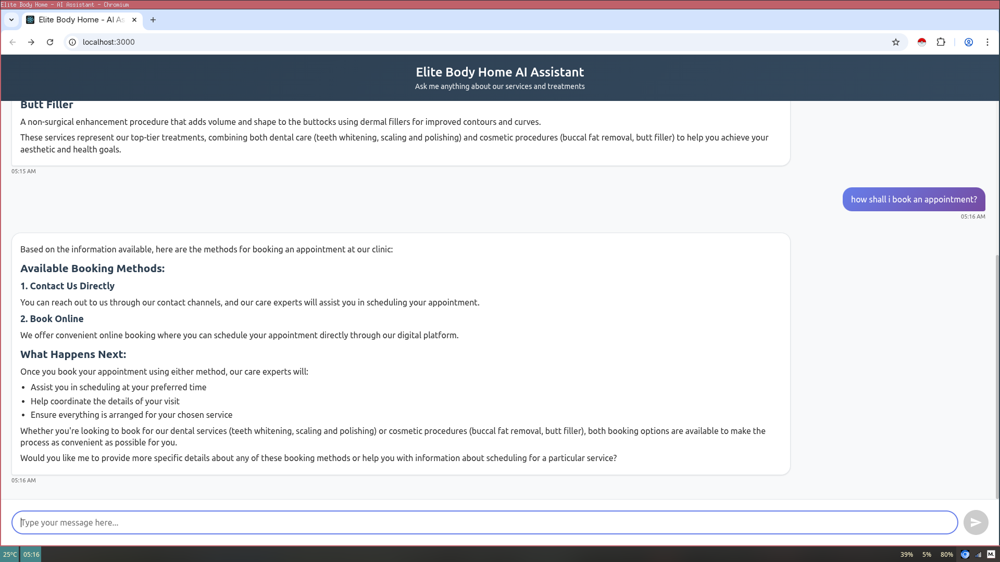
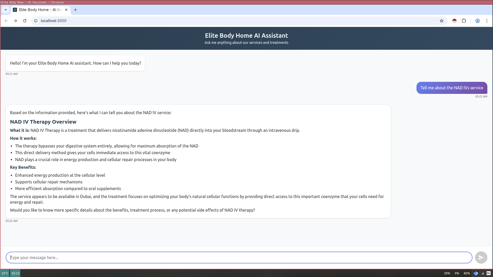

# Elite Body Home - AI Chatbot with Agentic RAG

A sophisticated AI-powered chatbot for Elite Body Home Polyclinic that uses an agentic Retrieval-Augmented Generation (RAG) system to provide accurate information about medical services, treatments, and procedures.

## 🌟 Features

- **Agentic RAG Architecture** - Multi-step reasoning with LangGraph workflow
- **Intelligent Document Retrieval** - FAISS vector database with semantic search
- **Conversational Memory** - Maintains context across multiple interactions
- **Modern React Frontend** - Responsive chat interface with real-time messaging
- **FastAPI Backend** - High-performance API with automatic documentation
- **Markdown Support** - Rich text responses with formatting
- **Session Management** - Persistent conversations with follow-up questions
- **Error Handling** - Graceful fallbacks and user-friendly error messages

## 🏗️ Architecture



### Backend (Python)
- **LangGraph** - Agentic workflow orchestration
- **LangChain** - LLM integration and document processing
- **FAISS** - Vector similarity search for document retrieval
- **FastAPI** - REST API framework
- **OpenAI GPT** - Language model for response generation

### Frontend (React.js)
- **React 18** - Modern UI framework
- **Axios** - HTTP client for API communication
- **React Markdown** - Rich text rendering
- **CSS Modules** - Component-scoped styling

### Data Pipeline
- **Web Scraping** - Automated content extraction from Elite Body Home website
- **Document Processing** - Text chunking and embedding generation
- **Vector Storage** - FAISS index for fast similarity search

## 📁 Project Structure

```
elite/
├── src/                          # Backend source code
│   ├── chain.py                  # LangChain integration
│   ├── graph.py                  # LangGraph agentic workflow
│   ├── llm.py                    # Language model configuration
│   ├── nodes.py                  # Graph node implementations
│   ├── preprocess.py             # Document processing utilities
│   └── state.py                  # Agent state management
├── frontend/                     # React frontend
│   ├── src/
│   │   ├── components/           # React components
│   │   ├── services/             # API integration
│   │   └── *.css                 # Styling
│   ├── public/                   # Static assets
│   └── package.json              # Frontend dependencies
├── pages/                        # Scraped website content
├── faiss_embeddings/             # Vector database files
├── app.py                        # FastAPI application
├── scrape_website.py             # Web scraping script
├── requirements.txt              # Python dependencies
├── .env                          # Environment variables
└── README.md                     # This file
```

## 🚀 Quick Start

### Prerequisites

- Python 3.8+
- Node.js 16+
- OpenAI API key

### 1. Clone and Setup

```bash
git clone <repository-url>
cd elite
```

### 2. Backend Setup

```bash
# Create virtual environment
python -m venv venv
source venv/bin/activate  # On Windows: venv\Scripts\activate

# Install dependencies
pip install -r requirements.txt

# Configure environment variables
cp .env.example .env
# Edit .env and add your OpenAI API key
```

### 3. Frontend Setup

```bash
cd frontend
npm install
```

### 4. Initialize Data (First Time Only)

```bash
# Scrape website content
python scrape_website.py

# Process documents and create embeddings
python -c "from src.preprocess import create_embeddings; create_embeddings()"
```

### 5. Run the Application

**Terminal 1 - Backend:**
```bash
python app.py
```
Backend will start at `http://localhost:8000`

**Terminal 2 - Frontend:**
```bash
cd frontend
npm start
```
Frontend will open at `http://localhost:3000`

## 🔧 Configuration

### Environment Variables (.env)

```env
# OpenAI Configuration
OPENAI_API_KEY=your_openai_api_key_here

# Optional: Model Configuration
OPENAI_MODEL=gpt-4
TEMPERATURE=0.1
MAX_TOKENS=1000

# Optional: API Configuration
API_HOST=0.0.0.0
API_PORT=8000
```

### Frontend Configuration

Edit `frontend/src/services/api.js` to change the backend URL:

```javascript
const API_BASE_URL = 'http://localhost:8000';
```

## 📱 Application Screenshots

### Chat Interface

*Modern React-based chat interface with responsive design*

### Conversation Flow

*Example conversation showing AI responses with markdown formatting*

### Interactive Features

*Real-time messaging with typing indicators and session management*

## 📖 Usage

### Basic Chat

1. Open the frontend at `http://localhost:3000`
2. Type your question about Elite Body Home services
3. The AI will provide detailed, accurate responses

### Example Conversations

**User:** "What botox services do you offer?"
**AI:** Lists available botox treatments with details

**User:** "What's the price for full face botox?"
**AI:** Provides pricing information for full face botox

**User:** "How long does it last?"
**AI:** Explains duration based on the previous context

### API Usage

**Direct API calls:**

```bash
curl -X POST "http://localhost:8000/chat" \
  -H "Content-Type: application/json" \
  -d '{
    "message": "What services do you offer?",
    "session_id": "user123"
  }'
```

## 🧠 How It Works

### Agentic RAG Workflow

1. **Question Analysis** - Determines if query is relevant to Elite Body Home
2. **Query Rephrasing** - Optimizes search terms for better retrieval
3. **Document Retrieval** - Finds relevant content using FAISS similarity search
4. **Context Assembly** - Combines retrieved documents with conversation history
5. **Response Generation** - Uses GPT to create accurate, contextual responses
6. **Memory Storage** - Saves conversation state for follow-up questions

### Document Processing Pipeline

1. **Web Scraping** - Extracts content from Elite Body Home website using Crawl4AI
2. **Text Chunking** - Splits documents into searchable segments using Langchain's Markdown Text splitter and recursive character text splitter
3. **Embedding Generation** - Creates vector representations using Bedrock embeddings
4. **Index Creation** - Builds FAISS index for fast similarity search

## 📊 API Documentation

### Endpoints

**POST /chat**
- **Description:** Send a message to the AI chatbot
- **Request Body:**
  ```json
  {
    "message": "Your question here",
    "session_id": "optional_session_id"
  }
  ```
- **Response:**
  ```json
  {
    "response": "AI response",
    "metadata": {
      "on_topic": true,
      "documents_retrieved": 3,
      "processing_time": 2.5
    }
  }
  ```

**GET /health**
- **Description:** Health check endpoint
- **Response:** `{"status": "healthy", "message": "API is running"}`

**GET /docs**
- **Description:** Interactive API documentation (Swagger UI)


```

## 🚀 Deployment

### Backend Deployment

```bash
# Install production dependencies
pip install gunicorn

# Run with Gunicorn
gunicorn app:app -w 4 -k uvicorn.workers.UvicornWorker --bind 0.0.0.0:8000
```

### Frontend Deployment

```bash
cd frontend
npm run build
# Deploy the 'build' folder to your hosting service
```

### Environment Variables for Production

```env
OPENAI_API_KEY=your_production_api_key
API_HOST=0.0.0.0
API_PORT=8000
CORS_ORIGINS=["https://yourdomain.com"]
```


**Elite Body Home Polyclinic** - Advanced Medical Aesthetics & Wellness
